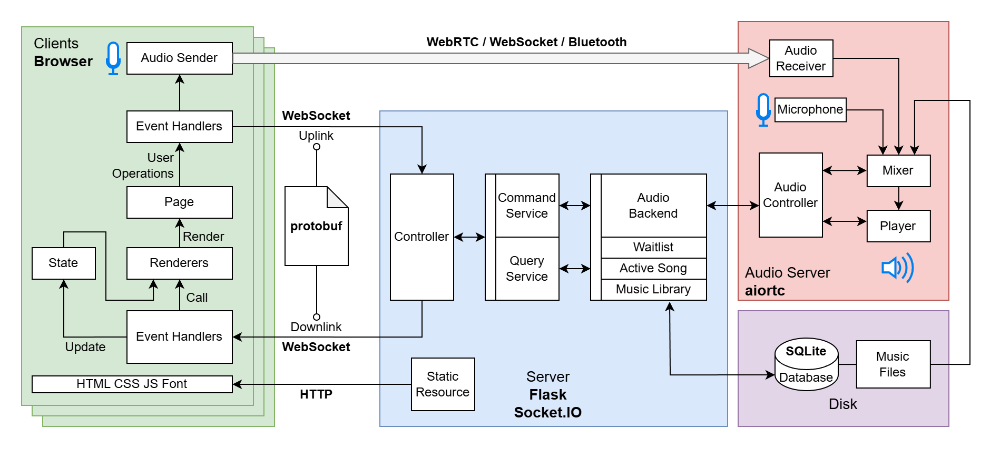

# KSONG: Karaoke Software Optimized for Networking and Games

## Architecture

 

## Usage

```bash
pip install -r requirements.txt
python server/main.py 5001 /path/to/db /path/to/music "http://0.0.0.0:5000/audio_ctrl" &
hypercorn audio_server/signaling:app --bind 0.0.0.0:5000
```

Replace `/path/to/db` with the path to your database. If no database file exists at that location, a new one will be created. Also, replace `/path/to/music` with the directory where you store your music.