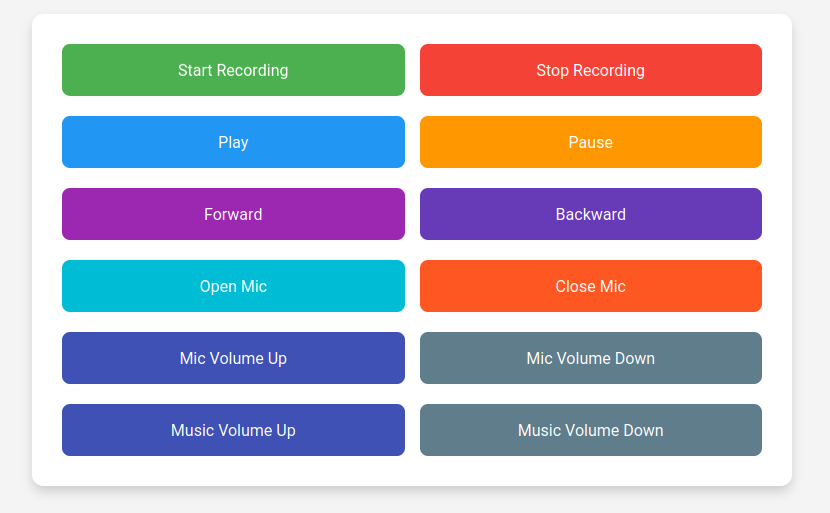
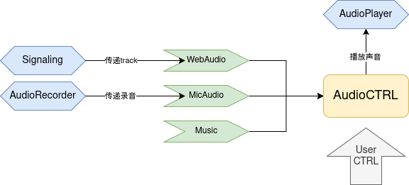

### Network-Project

#### 基础介绍
本代码聚焦于远程音频传输的问题，大致实现了以下的内容：
- 多端远程音频传输：利用webRTC和quart框架搭建的远程音频传输。**延时不可避免的会比较高**。
- 歌曲和歌声混合：存在少量bug, 当在歌曲播放情况下开启歌声录制时，有时会发生卡顿，此时**重启歌声录制即可**。
- 服务器音频录制和播放：延时低，bug少。
#### 示例介绍
示例文件主要由client和server构成。用户在自己的浏览器中打开index.html文件，并在本地打开signaling.py文件，即可进行交互。

- Start Recording：开始连接，远程音频传输并本地播放。
- Stop Recording：结束连接。
- Play：播放服务器音乐
- Pause：暂停播放服务器音乐
- Forward：快进服务器音乐10s
- Backward：快退服务器音乐10s
- Open Mic：打开本地麦克风
- Close Mic：关闭本地麦克风
- Mic Volume Up：调高麦克风音量
- Mic Volume Down：调低麦克风音量
- Music Volume Up：调高音乐音量
- Music Volume Down：调低音乐音量

注意：
1. 目前可以支持多端远程输入音频，但是延时比较大。目前就主流的通信软件也无法降低这个时延到一个可以忽略的地步。
2. 当歌曲在播放时，开启麦克风录制，有小概率会发生卡顿和大量噪音（尚待解决）。此时只需要重新启动麦克风录制即可。
3. 由于本代码不聚焦于前端，因此给的接口纯粹是为了测验所用。

#### 代码端口介绍

signaling.py：核心文件。主要负责所有和远程的通信，包括SDP交换，ICE交换以及webRTC建立等等。其中webRTC用track将客户端和服务器端相连接，signaling.py将调用audioCTRL.py来实现对音频的综合控制（包括对track中的音频帧的具体处理）。

audioCTRL.py：核心文件。主要负责音频播放模块的综合控制，其具体功能和端口如下：
- create_play_thread: 需要在初始化AudioController之后立即使用，为音频播放程序创建单独线程。
- create_microphone_thread: 需要在初始化AudioController之后立即使用，为服务器麦克风录音程序创建单独线程。
- start_audio_playback：开启音频播放程序。
- stop_audio_playback：关闭音频播放程序。
- load_music_file(file_path)：加载服务器端音乐/歌曲，目前只支持wav格式。
- play_music：播放音乐/歌曲
- pause_music：暂停播放音乐/歌曲
- adjust_playback_time(time_offset): 调整音乐/歌曲的时间轴，采用相对时间。
- adjust_volume(volume_delta, is_microphone)：调整麦克风或者音乐/歌曲的音量。
- add_audio_track(track)：webrtc新建track连接，会单独开设一个协程来处理。
- start_microphone_recording：开启服务器麦克风录音。
- stop_microphone_recording：关闭服务器麦克风录音。

其余以"_"为前缀命名的函数均为private函数，不暴露接口，这里不作详述。

audioplayer.py：辅助文件。负责音频播放。
audiomixer.py：辅助文件。负责音频混合，后期的延伸操作均为对这个函数进行的拓展。
audiorecorder.py：辅助文件。负责调用服务器端的麦克风。

#### 框架图
其实从本质上来讲，audioCTRL.py应该是该模块的核心之核心，而示例中因为需要测试，所以把main设置为了signaling了，后面可以进行调整。但是框架图还是按照audioCTRL为核心进行绘制。

