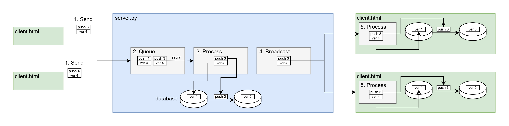

# 系统功能验证

## Getting started

安装 python 依赖:

```bash
pip install Flask Flask-SocketIO redis flask-cors pyopenssl
```

```bash
sudo apt install portaudio19-dev
pip install pyaudio
```

安装并启动 redis (Debian / Ubuntu):

```bash
sudo apt-get install lsb-release curl gpg
curl -fsSL https://packages.redis.io/gpg | sudo gpg --dearmor -o /usr/share/keyrings/redis-archive-keyring.gpg
sudo chmod 644 /usr/share/keyrings/redis-archive-keyring.gpg
echo "deb [signed-by=/usr/share/keyrings/redis-archive-keyring.gpg] https://packages.redis.io/deb $(lsb_release -cs) main" | sudo tee /etc/apt/sources.list.d/redis.list
sudo apt-get update
sudo apt-get install redis
```

运行服务端：

```bash
python server.py 5002
```

在浏览器中打开 client 端：

```bash
firefox 127.0.0.1:5002 &
firefox 127.0.0.1:5002 &
firefox 127.0.0.1:5002 &
```

功能：

1. 增量同步：任何一个 client 请求的更新都会同步到其他节点上，增量同步
2. 音频流转：在其中一个 client 点击录制，将会实时录制麦克风传输到后端，后端播放

## 增量同步原理



简单起见，model 只存储一个栈，有两个操作，push 和 pop。

1. 客户端向服务端发送要执行的操作，比如 push 3，以及要操作的数据库的版本号，比如 4
2. 服务端接收到操作消息后，把消息放入消息队列
3. 服务端的处理程序每次从消息队列中取出一个操作，检查服务端数据库的版本号是否与客户端发来的对应版本号，然后处理该操作
4. 将应用的操作广播给所有客户端
5. 客户端更新自己的数据库

为什么需要版本号？

- 某个客户端可能没有得到最新的数据库，还是在旧的数据库上更改，需要拒绝这类请求
- 客户端可能收到两个数据库更改，但是两个更改的顺序是错的，可以借助版本号，排序以得到正确的更改顺序

## 音频流转原理

前端使用 [MediaStreamRecorder.js](https://github.com/streamproc/MediaStreamRecorder) 录制 PCM 音频，通过 WebSocket 将音频段发到后端，后端调用 PyAudio 播放音频。

问题：延迟大，回环测试 ~100ms，局域网测试 ~400ms，对于实时麦克风来说不可用；不稳定，后端收到音频段的时间波动大，需要进一步设计在后端设计缓冲区保证平稳播放。

